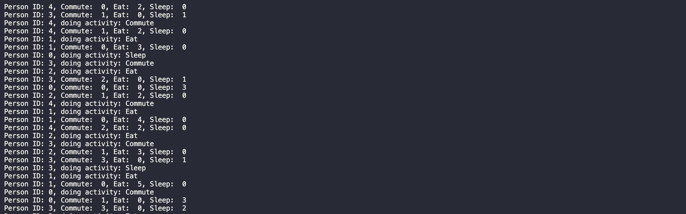

# A Life Simulation

**NOTE**: This is a starter repo for the Capstone project in the [Udacity C++ Nanodegree Program](https://www.udacity.com/course/c-plus-plus-nanodegree--nd213).

In this project, I've built from scratch a system that logs the daily activities of one or multiple people, that is up to the user. This choice was influenced by the desire of putting into practice, what I learned about **smart pointers** and **concurrency** in C++. When you run the programs you will be asked how many people you want to participate in the simulation, then you will see how each person does a sequence activities. There are few activities, and each of them cannot be done by more than one person at the same time. That is where concurrency will handle all the activity threads accepting people requests and move them around other activities. The program running looks like this:

The program shows in the standard output:
* which activity is being performed, and the person ID doing the activity
* the number of times each user does every activity
An additional thread makes the program to run for about 60 seconds. This can be tweaked in function *setTimer()* within `src/main.cpp`.

If you want more details about the internals of the program, check [explanation.md](explanation.md)

## Dependencies for Running Locally
* cmake >= 3.7
  * All OSes: [click here for installation instructions](https://cmake.org/install/)
* make >= 4.1 (Linux, Mac), 3.81 (Windows)
  * Linux: make is installed by default on most Linux distros
  * Mac: [install Xcode command line tools to get make](https://developer.apple.com/xcode/features/)
  * Windows: [Click here for installation instructions](http://gnuwin32.sourceforge.net/packages/make.htm)
* gcc/g++ >= 5.4
  * Linux: gcc / g++ is installed by default on most Linux distros
  * Mac: same deal as make - [install Xcode command line tools](https://developer.apple.com/xcode/features/)
  * Windows: recommend using [MinGW](http://www.mingw.org/)

## Basic Build Instructions

1. Clone this repo.
2. Make a build directory in the top level directory: `mkdir build && cd build`
3. Compile: `cmake .. && make`
4. Run it: `./ALifeSimulation`.
