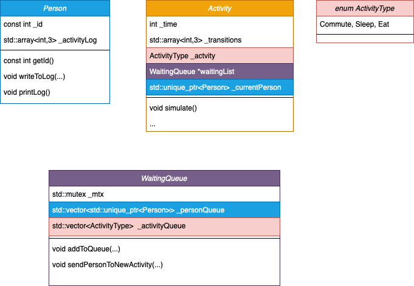
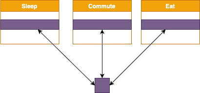
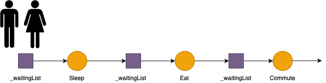

# Project explanation

## Object descriptions

The project contains the following types of objects:

* *Person*, object that moves around activities in a concurrent fashion. The number of objects of this type are specified by the user once the program is launched.
* *Activity*, object that defines the activity it is going performed by the user. In the program there are only three types of activities: *Commute*, *Sleep* and *Eat*. Each activity has two properties: the time it takes to perform the actvity `_time`, expressed in milliseconds, and the array `_transitions`, that defines the probability of jumping to another activity. The order of the elements of the array follows the structure of the enum *ActivityType*.

The object *Activity* has two more attributes. `_currentPerson`is the *Person* that at that moment is performing the activity. Every *Activity* has a pointer to a `WaitingQueue` object, which actually point to the same memory address. The `WaitingQueue` object is shared by all instances of object *Activity*.

* *WaitingQueue*, object is used as a hub once a *Person* has performed an *Activity*. This object contain two vectors. One storing unique pointers of type *Person*, and a vector of type *ActivityType* that stores the activity that the person with the same index is going to do next.
Every *Activity* will interact with the *WaitingQueue* concurrently, that's why it is necessary to use locks and mutexes to send and collect *Person* objects.

## Threading

Every *Actvity* executes the function `simulate()` in a single thread. This function has the following steps:

1. If there is no *Person* in the *Activity* ask for a new one to *WaitingQueue*
2. Perform the activity
3. Decide the new activity by sampling from `_transitions` 
4. Send the *Person* back to *WaitingQueue* so that it becomes available in future requests

At the end, each *Person* will be moving back and forth between the *WaitingQueue* and all of the activities.

